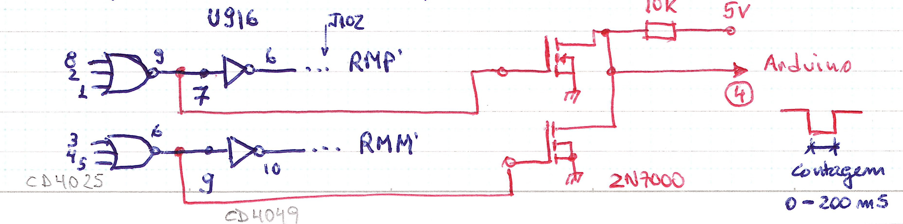
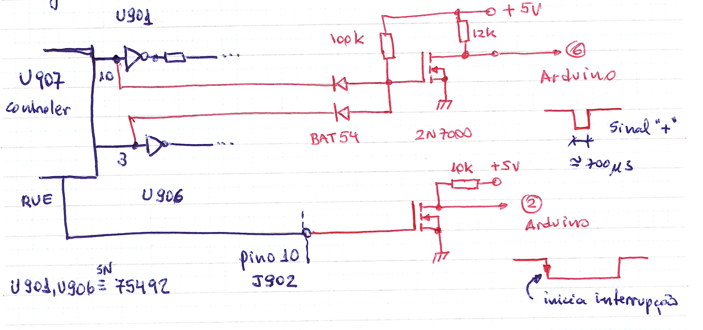
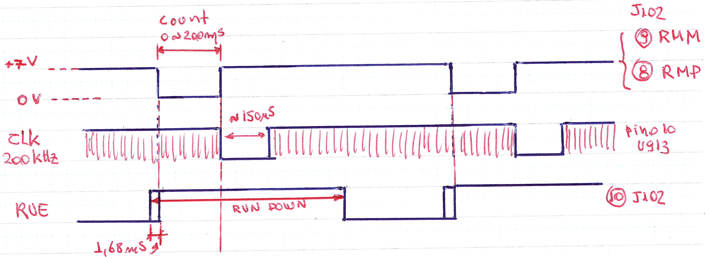
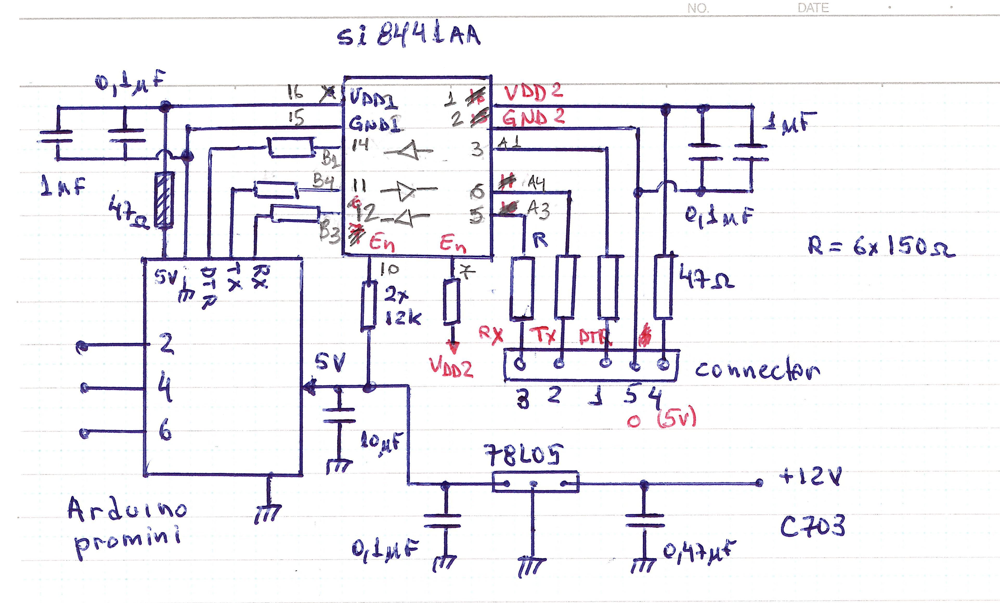
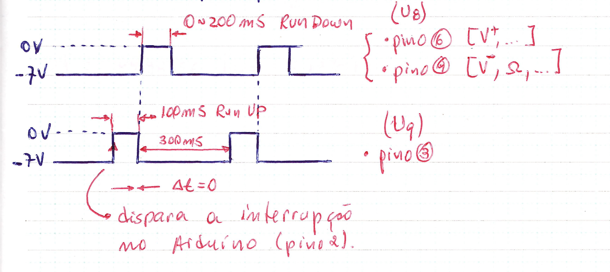
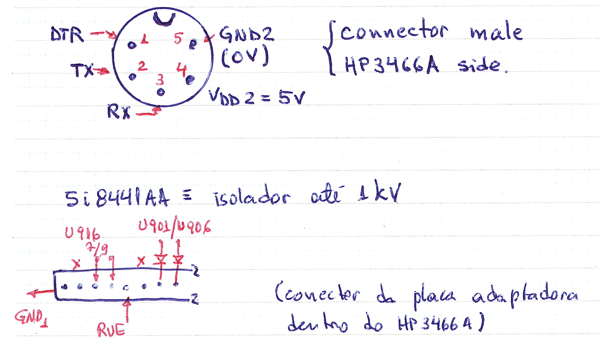

# HP3466A-and-HP3465B
Modification for reading the HP3466A and HP3465B 

 >Prof. Edson M. Kakuno   

 [Física](http://cursos.unipampa.edu.br/cursos/licenciaturaemfisica/) - Unipampa Bagé   

The HP 3466A uses a dual-ramp ADC. The Arduino is used to measure the discharge ramp time of the integrator capacitor (C402), RunDown (fig. 8.4 of the manual). The charge time (RunUp) of C402 is always fixed at 100 ms and the accumulated (integrated) charge in C402 is proportional to the multimeter's input signal.

Capacitor C402 charges with positive or negative polarity depending on the selected function / scale. The controller generates 2 signals to unload C402 (RunDown), Ramp- (RMM) and Ramp+ (RMP). These two signals are extracted from U916, pins 7 and 9, and feed an OR gate formed by 2x 2N7000 (MOSFET), the temporal width of this pulse corresponds to the RunDown, i.e. the multimeter's input reading value.

To determine the polarity of the input signal, the “+” signal is read through two signals on pin 3 of U906 and pin 10 of U901. It supplies two BAT54 diodes and one FET 2N7000, which generates a negative pulse of the order of 700 us if the “+” signal is activated and no pulse if the “+” signal is not activated.
RunDown starts with a pulse on the RUE (RunUp Enable) line. This signal feeds a FET (2N7000) which triggers the interrupt on the Arduino and the interrupt routine starts reading the pulse width (Ramp- or Ramp+).

Fig.1: Reading the RunDown time.

Fig.2: Reading of “+” sign and start of interrupt (reading of RUE signal).

Fig.3: ADC timing diagram.

The counting process starts with RUE line transitioning to level "1", after 1.68 ms the RMM (or RMP) line changes to level "0", starting the counting time (which is proportional to the multimeter input value) and discharging C402. When C402 is fully discharged, it ends the count by changing the RMM (or RMP) line to level “1”.

The RUE line transition triggers the Arduino interrupt (pin 2). In the interrupt routine there are 2 commands:
(a) One to measure the temporal width (pulseIn) of pin 4 of the Arduino that corresponds to the RMM or RMP lines.
(b) The second command measures the temporal width (pulseIn) of pin 6 of the Arduino that corresponds to the triggering of the “+” signal. If the reading of pin 6 returns “zero”, it means that the polarity of the input signal is “-”.

Obs.1: Measurements of Vac, Iac and Resistance (Ohms) no signal (“+” or “-”) is triggered and therefore the reading returns as if it were a negative value.

Obs.2: in the “Ohms” function, OVL (over load) corresponds to ~270 ms.

Obs.3: The diagram of the LED display represented on page 8.34 is incorrect. Consult the HP5082 display data sheet (see material list).

- It is always possible to correct the Arduino readings, by a multiplicative factor, close to 1.  

Fig.4: Arduino connection diagram

The Arduino's serial communication lines are connected through an electrical isolator (Si8441AA) which allows the HP3466A (battery-powered) to carry out measurements in non-Earth referenced systems. It has not been tested but is believed to support at least 500 Vdc isolation. 

The base code that can be modified for each specific need. The first block (from top to bottom) defines the variables: RUE (triggers the interrupt) the pin number of the Arduino that receives this signal (pin 2 in this case, the Arduino interrupts are on pins 2 and 3) and similarly to the Ramp (pulse width proportional to the measured value, RunDown) and Sign (signal of the measured value). The variables “signal” and “read” are of the volatile type, as their values are assigned within the interrupt routine. In the second block (void setup()), the parameters are defined, (a) “Serial.begin(9600)” defines the serial communication speed in 9600 baunds; (b) “pinMode(Ramp, INPUT)” defines pin 2 of the Arduino as digital input and same as for “Ramp” and “Sign”; (c) “attachInterrupt(digitalPinToInterrupt(RUE), readADC, FALLING)” enables interrupt on pin 2, and calls routine “readADC” when a falling edge occurs on pin2. The third block (void loop()) runs a loop routine, initially activates digital pin 13 (lights the Led of the Arduino board), sends the value of the variable “read” to the serial port, the “ln” of the print does skips a line (CR+LF) and sends the “signal” value, turns off the Led and waits for 400 ms (within this time another reading from the multimeter is expected, i.e. another interrupt must appear before this time elapses. The last block corresponds the interrupt routine: (a) “read = pulseIn (Ramp,LOW,250000)” pulseIn reads the time that pin 4 (Ramp) remains in the low state (Low) and the value of 250000 us corresponds to the maximum time for execution of this command, if pin 4 does not have a low level, “read” will be equal to “zero.” If the low pulse remains for more than 250 ms, reading also returns “zero.” Note that the expected value is from zero to 200 ms (which corresponds to the reading of the multimeter from zero to full scale), there are cases of overload (OVL) in which this value is greater, for example on the scale of Ohms, the OVL corresponds to approximately 270 ms, so it is interesting to adjust this value to close to 300 ms. It is important to remember that from the total measurement time, there is 100 ms for the Run Up, a few ms for the zero adjustment and almost 2 ms to determine the signal. The total time for a multimeter measurement is 400 ms. The pulseIn returns the time read in us (microseconds). (b) "signal = pulseIn (Sign,LOW,5000);" in an same way, it reads the lapsed time of pin 6, if the sign is “+” it returns a value around 700 us and if there is no sign “+” it returns “zero”. Note that the “-” sign is not defined and has measurements that do not have “+” or “-” sign, Ohms, AC voltage and current and that the program may mistakenly insert the “-” sign! 

#Modification of HP3465B for reading with Arduino

The HP3465B is one generation prior to the HP3466A, both have a minimum sensitivity of 1 uV (20 mVdc scale) and 4 1/2D resolution. The HP3465b also utilizes a dual-ramp ADC. The charge time of the integration capacitor (RunUp) is fixed at 100 ms and the discharge time (RunDown) varies according to the measured value and is between 0 to 200 ms. The integration capacitor is C19 (0.44 uF), diagram 2.

Arduino measures the RunDown time through the pulseIn function and returns this time measured in microseconds. Depending on the input signal polarity, the integration ramp can be positive or negative, so there are two signals for RunDown: pin 6 of U8 (signal I1) for positive voltage measurements and pin 9 of U8 (signal I2) for measurements of negative voltages and resistance measurements (Ohms), ac voltage and ac current. The complete measurement cycle (zero, RunUP and RunDown) is controlled by pin 3 of U9 (IO signal) and takes around 400 ms.

Fig.5: Modification to adapt RunDown time and interrupt signals for measurement by Arduino platform and Arduino input and output connection.

The IO signal feeds a FET (2N7000) and triggers the interrupt (pin 2) on the Arduino. In the interrupt routine, signals I1 and I2 trigger two FETs (2N7000) in the OR configuration and the output is connected to pin 4 of the Arduino, which through the pulseIn command measures the time of the I1I2 signal (which corresponds to the multimeter's input signal ) and returns the value in microseconds. And pin 6 of the Arduino is connected to the PL signal (polarity) of the HP3465B, which at the input of the interrupt routine reads pin 6 with the digitalRead command which returns false or true according to the polarity of the input signal.

Fig.6: ADC timing diagram.

As there is no temporal delay between the falling edge of RunUp (charge period of capacitor C19 and fixed time at 100ms) and rising edge of RunDown (the falling edge of C19 varies according to the accumulated charge in RunUP, therefore, this time goes from zero to 200 ms - full scale), so the start of interrupt is trigged at the start of RunUP and the interrupt routine will measure the RunDown pulse width time. In the 100 ms interval between the start of the interruption and the start of the RunDown measurement, the level of the PL point (polarity) is observed and recorded whether the polarity of the measured signal is positive or not (see the discussion of polarity of the HP3466A).

Similar to the modification of the HP3466A, an Arduino ProMini (Atmega 328) is used. The difference on the HP3465B is that the logic part is powered by negative voltage, so the -7 V represents the “zero” level and the 0 V (ground) represents the “one” level. As the Arduino works between 3V3 and 5V0 the ground potential (0V) is “raised” through a 3V0 zener connected to ground, ie the Arduino is between the potentials of -7V and -2.7 V (difference of 4 .3V). The “zero” level remains at -7V0 and the “one” level is shifted to -2V7, which is what makes the 3V0 zener on the PL line and the FET transistors for the RunDown interrupt and measure signals. Note that VCC in the diagram in Fig.5 corresponds to -2V7.

The base code is the same as the HP3466A, and the “IO” signal triggers the interrupt on pin 2; the “I1I2” signal carries the RunDown information to pin 4 and the “Sign” signal the level referring to the existence or not of the “+” signal in the measurement. Here the difference is that for “Sign” the pulse width is not measured, but the logic level “1” or “0” (command “digitalRead(Sign)”). The rest of the analysis is similar to the one performed above for the HP3466A code.

Note: It is not implemented yet, but it is intended to perform the reading on the computer using the Python program to set up a routine for reading the serial port. It is also necessary to connect a USB-Serial converter (TTL) externally to the Multimeter that has the DTR (reset) terminal, alternatively, you can use an Arduino Uno board, remove the Atmega328 chip (from the socket) and use the Rx and Tx pins (digital 0 and digital 1 of the board) and the Reset for the DTR, in addition to the ground ( 0 V ) and 5V0.

It is suggested to add in the code a multiplicative variable (“factor” for example) to correct small deviations in the reading, by multiplying the value read by this factor (“reading” * or / “factor”). It is also possible to implement an averaging routine and send the read average value to the computer.

Extra care must be taken if you use automatic scaling on the Multimeter, as the function and scale information is not passed to the Arduino. It is also not possible to control (send commands to the Meter) remotely.

The entire arrangement of measurements must be performed manually and only readings (or collections) are performed automatically. 

Appendix: Other connections

Pin distribution on the Multimeter's rear panel connector and signal distribution on the HP3466A internal adapter card connector.

* Identification of external cable wires:

- Mesh = Earth (0V);
- Red = 5V0;
- Black = Reset (DTR);
- White = Tx (Arduino transmitting)
- Green = Rx (Arduino receiving)

Comments:

(a) HP3466A: Fosc = 199.9046 kHz;

(b) HP3465B: Fosc = 99.9356kHz;
 
Measured with HP3416B (frequency meter).

- Mesh = Earth (0V);
- Red = 5V0;
- Black = Reset (DTR);
- White = Tx (Arduino transmitting)
- Green = Rx (Arduino receiving)
