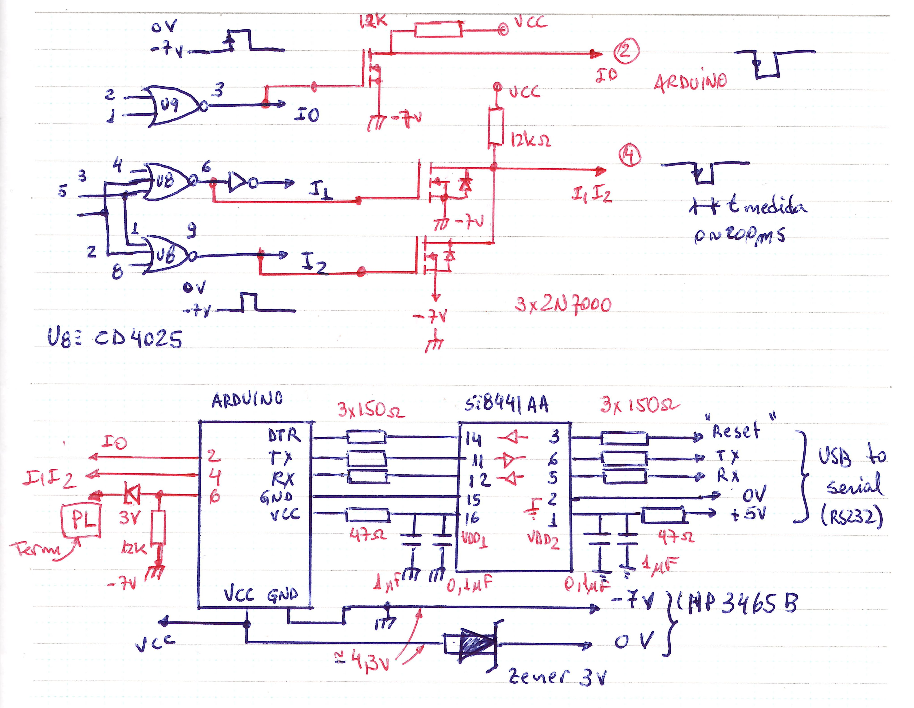

# HP3466A-and-HP3465B
Modification for reading the HP3466A and HP3465B 

 >Prof. Edson M. Kakuno   

 [Física](http://cursos.unipampa.edu.br/cursos/licenciaturaemfisica/) - Unipampa Bagé   

The HP 3466A uses a dual-ramp ADC. The Arduino is used to measure the discharge ramp time of the integrator capacitor (C402), RunDown (fig. 8.4 of the manual). The charge time (RunUp) of C402 is always fixed at 100 ms and the accumulated (integrated) charge in C402 is proportional to the multimeter's input signal.

Capacitor C402 charges with positive or negative polarity depending on the selected function / scale. The controller generates 2 signals to unload C402 (RunDown), Ramp- (RMM) and Ramp+ (RMP). These two signals are extracted from U916, pins 7 and 9, and feed an OR gate formed by 2x 2N7000 (MOSFET), the temporal width of this pulse corresponds to the RunDown, i.e. the multimeter's input reading value.

To determine the polarity of the input signal, the “+” signal is read through two signals on pin 3 of U906 and pin 10 of U901. It supplies two BAT54 diodes and one FET 2N7000, which generates a negative pulse of the order of 700 us if the “+” signal is activated and no pulse if the “+” signal is not activated.
RunDown starts with a pulse on the RUE (RunUp Enable) line. This signal feeds a FET (2N7000) which triggers the interrupt on the Arduino and the interrupt routine starts reading the pulse width (Ramp- or Ramp+).

Fig.1: Reading the RunDown time.

Fig.2: Reading of “+” sign and start of interrupt (reading of RUE signal).

Fig.3: ADC timing diagram.

The counting process starts with RUE line transitioning to level "1", after 1.68 ms the RMM (or RMP) line changes to level "0", starting the counting time (which is proportional to the multimeter input value) and discharging C402. When C402 is fully discharged, it ends the count by changing the RMM (or RMP) line to level “1”.

The RUE line transition triggers the Arduino interrupt (pin 2). In the interrupt routine there are 2 commands:
(a) One to measure the temporal width (pulseIn) of pin 4 of the Arduino that corresponds to the RMM or RMP lines.
(b) The second command measures the temporal width (pulseIn) of pin 6 of the Arduino that corresponds to the triggering of the “+” signal. If the reading of pin 6 returns “zero”, it means that the polarity of the input signal is “-”.

Obs.1: Measurements of Vac, Iac and Resistance (Ohms) no signal (“+” or “-”) is triggered and therefore the reading returns as if it were a negative value.

Obs.2: in the “Ohms” function, OVL (over load) corresponds to ~270 ms.

Obs.3: The diagram of the LED display represented on page 8.34 is incorrect. Consult the HP5082 display data sheet (see material list).

- It is always possible to correct the Arduino readings, by a multiplicative factor, close to 1.  

